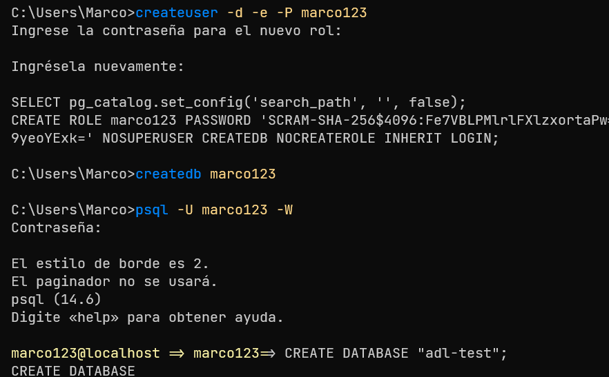
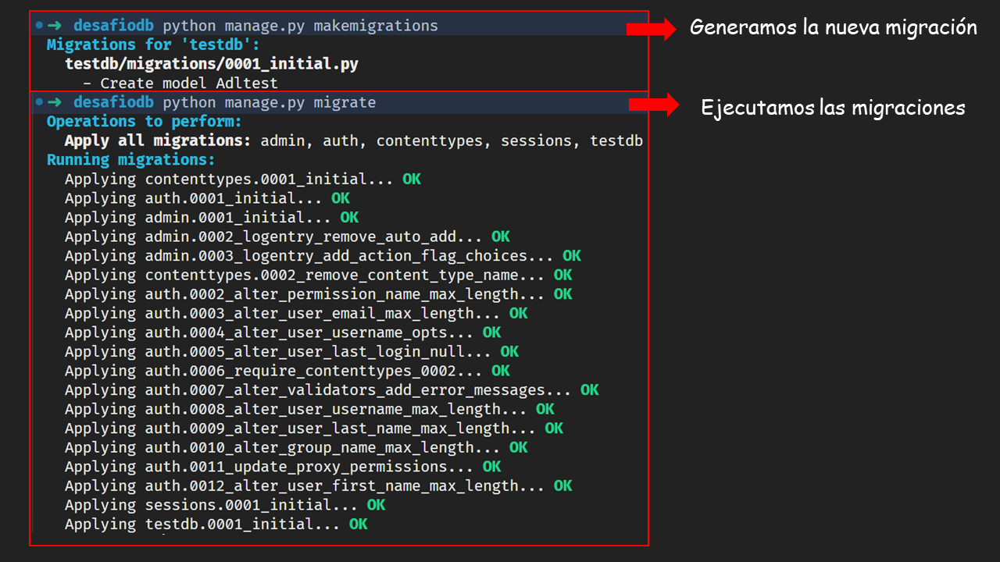
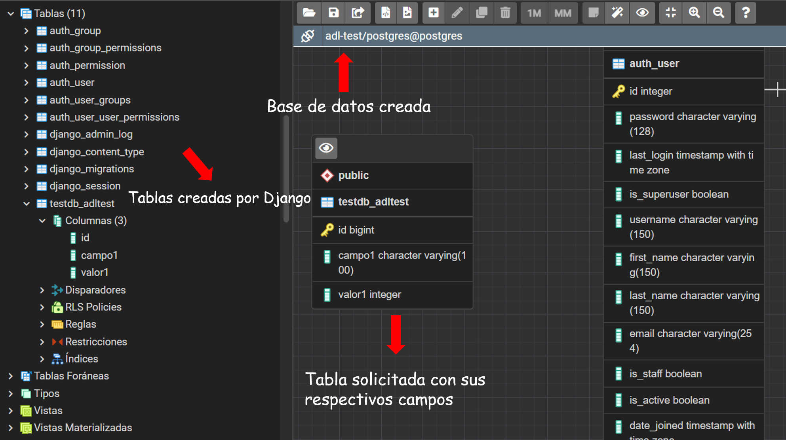

## Requerimiento 1

Instalación del motor de base de datos Postgresql, creación de base de datos y asignación de permisos al usuario por defecto. Adjuntar una captura de pantalla de la asignación de permisos al usuario y de la base de datos vacía.

## Requerimiento 2

Entregar el proyecto en un archivo .zip con el nombre del desafío y su nombre con el siguiente formato “proyecto-desafio1-nombre-apellido.zip”.

[(Este repositorio)](https://github.com/EniDev911/proyecto-desafio1-marco-contreras/archive/refs/heads/main.zip)

## Requerimiento 3

Captura de pantalla donde se visualice la correcta ejecución de las migraciones:

## Requerimiento 4

Captura de pantalla de pgadmin, donde se pueda visualizar la base de datos creada, la tabla solicitada con sus campos y las tablas generadas por Django:

